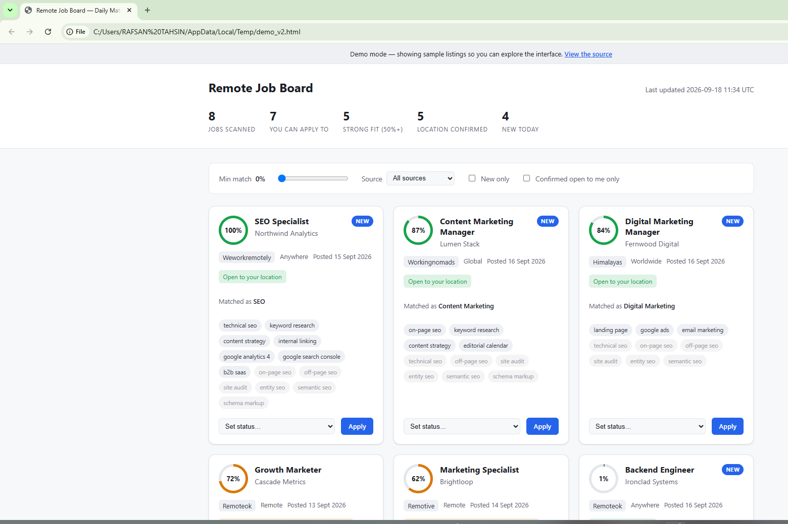

# Remote Job Board

A zero-cost, serverless job aggregator that scans six free remote-job
sources daily, filters out roles the candidate legally can't apply to from
their own country, scores what's left as an explainable percentage match,
and publishes a static dashboard - no backend, no database server, no paid
APIs, no API keys.

**[Live demo](https://rafshantashin.github.io/remote-job-board/)** &middot; built with Python 3.11, SQLite, Jinja2, and GitHub Actions.

> The live demo above runs the pipeline against a handful of fictional
> sample listings (`jobboard/fixtures/sample_jobs.py`), so the page is
> always populated and reproducible. Every company name in it is invented.



## Architecture

```
   ┌─────┐  ┌──────────┐  ┌──────────┐  ┌───────────┐  ┌─────────┐  ┌────────┐
   │ WWR │  │ RemoteOK │  │ Remotive │  │ Himalayas │  │ Working │  │ Jobicy │
   │ RSS │  │   API    │  │   API    │  │    API    │  │ Nomads  │  │  API   │
   └──┬──┘  └────┬─────┘  └────┬─────┘  └─────┬─────┘  └────┬────┘  └───┬────┘
      └──────────┴─────────────┴────┬─────────┴─────────────┴───────────┘
                                     │  concurrent fetch, per-source
                                     │  timeout + retry (pipeline/fetch.py)
                                     ▼
                     eligibility (pipeline/eligibility.py)
                     can this candidate apply from their country at all?
                     OPEN / UNCONFIRMED kept, BLOCKED dropped
                                     │
                                     ▼
                     dedupe (pipeline/normalize.py)
                     sha256(company + title), preferring the OPEN copy
                     of a posting syndicated across several boards
                                     │
                                     ▼
                     score against profile.json (pipeline/score.py)
                     role fit 65 + domain fit 20 + skill overlap 15
                     - penalties, clamped 0-100
                                     │
                                     ▼
                     upsert into SQLite (pipeline/store.py)
                     first_seen tracked -> "new in the last 24h"
                                     │
                                     ▼
                     render index.html (render/build.py + template.html.j2)
                     one self-contained file, no build step, no framework
                                     │
                                     ▼
                          GitHub Actions -> GitHub Pages
```

Each source in `jobboard/sources/` is an independent adapter returning the
same normalized shape (`source, external_id, title, company, location, url,
description, tags, posted_at`). `pipeline/fetch.py` runs all six
concurrently in a thread pool; a failing or slow source is caught, logged,
and contributes zero listings rather than aborting the run.

Every surviving listing is shown, each with its own match percentage - the
dashboard's slider does the filtering, rather than the pipeline deciding
in advance what you're allowed to see.

## Can I actually apply? (eligibility)

Most "remote" listings are remote *within a region*. In one real run, 470
listings came back and **170 were locked** to the US, EU, UK or LATAM.
Scoring them would be wasted effort, so `pipeline/eligibility.py` classifies
every listing before it reaches the scorer:

| Verdict | Meaning | Outcome |
|---|---|---|
| `OPEN` | Anywhere/Worldwide/Global/APAC/Asia, or the source confirms it | Shown, green badge |
| `UNCONFIRMED` | Says only "Remote", no region named | Shown, amber "verify before applying" badge |
| `BLOCKED` | Names a region that excludes the candidate, or demands local work authorization | Dropped |

Himalayas publishes machine-readable `locationRestrictions` and
`timezoneRestrictions`, so for that source the verdict is read directly
rather than inferred from prose. Everything else is classified from its
location field plus authorization phrases in the body - which is why
`UNCONFIRMED` exists as its own outcome instead of being guessed either way.

## Scoring, explained

The score answers *"is this a job I could apply for?"*, not *"how many of
my tools does it name"*. A Marketing Specialist posting that never mentions
GA4 is still a job worth seeing, so `ProfileScorer` (`pipeline/score.py`)
weights three signals:

| Signal | Points | What it reads |
|---|---:|---|
| **Role fit** | 65 | The job title, matched against the `target_roles` families in `profile.json` (SEO, Digital Marketing, Content Marketing, Growth, Marketing, Content Writing). Each family carries its own weight, so an SEO Specialist role outranks a generalist marketing one. |
| **Domain fit** | 20 | How strongly the description reads as marketing/SEO work at all, via a domain vocabulary list. Saturates at 8 terms. |
| **Skill overlap** | 15 | Weighted profile skills found anywhere in the listing. A confidence signal, and the source of the chips on each card. |

A title match earns full role credit; the same phrase appearing only in the
body earns a quarter of it, because a Product Manager JD that mentions the
marketing team is not a marketing job. And if no role family matches at
all, the domain and skill points are cut to a quarter - "campaign" and
"funnel" show up in sales and engineering ads too, so they can't carry a
listing on their own.

Two penalties then subtract:

- **Seniority mismatch** (-25) - leadership titles (director, head of, VP,
  chief), junior ones (intern, student, trainee), or an explicit ask far
  above the profile's experience. "Senior" and "Manager" are deliberately
  *not* penalized; the candidate has 5+ years and applies at both levels.
- **Timezone/region preference** (-12) - soft signals like "must overlap
  with EST" that don't disqualify but do make the role a worse fit.

The matched role family and the matched/missing skills are all stored
alongside the score, so each card can show *why* it ranked where it did -
the percentage is never a black box.

Matching uses word-boundary regex, not plain substring search. An early
version matched the 3-letter skill "CRO" inside ordinary words like
"across" and "cross-functional", which quietly inflated nearly every score.

### Calibration

The scoring was tuned by replaying it against 300+ real listings captured
from these sources, not against invented samples. A first version was
normalized against a ceiling no real posting could reach, so genuine
matches topped out at 7% while the hand-written demo data scored 95% - the
sample data had been written to fit the formula instead of the formula
being validated against reality. The current curve puts real SEO and
digital-marketing roles at 50-100%, adjacent marketing roles at 30-60%,
and everything non-marketing below 10%.

## Demo mode

`python jobboard/main.py --demo` skips the network entirely and scores a
small set of hand-written fictional listings
(`jobboard/fixtures/sample_jobs.py`) instead, rendering from a throwaway
in-memory database. It's the same normalize/filter/score/render path a
live run takes - only the input differs - which makes it useful both for
the deployed demo page and for eyeballing template changes without
waiting on five APIs.

## Setup

```bash
git clone https://github.com/RafshanTashin/remote-job-board.git
cd remote-job-board
python -m venv .venv
source .venv/bin/activate   # .venv\Scripts\activate on Windows
pip install -r requirements.txt
```

Requires Python 3.11+.

### Run it

```bash
# Fetch and score real listings without writing anything (safe to run anytime):
python jobboard/main.py --dry-run

# Full run: fetch, score, write jobs.db and index.html:
python jobboard/main.py

# Build the demo dashboard (bundled sample data, no network calls):
python jobboard/main.py --demo

# Override where output goes:
python jobboard/main.py --db-path /path/to/jobs.db --output-path /path/to/index.html
```

### Test

```bash
pytest
```

47 tests cover role-first scoring (role families, title-vs-body weighting,
penalties, clamping), country eligibility (including Himalayas' structured
restrictions and the timezone check), role exclusion, closing-date and
staleness handling across every date format the sources emit, storage and
the live-listing window, and dedupe/hashing - against a small fixture
profile and sample listings (`jobboard/tests/conftest.py`).

## Automation

`.github/workflows/demo-pages.yml` rebuilds and redeploys the demo page on
every push to `main` (and on demand via `workflow_dispatch`). It doesn't
run on a schedule, since the sample data never changes.

For a live daily scan, point a scheduled workflow at `python
jobboard/main.py` with `--db-path`/`--output-path` set to wherever the
results should land.

## Sample output

From a real `--demo` run against the bundled fictional listings (see the
[live demo](https://rafshantashin.github.io/remote-job-board/) for the
interactive version - real production runs return real company names,
which is exactly what stays out of this public repo):

| Match | Matched as | Title | Company | Eligibility |
|------:|------------|-------|---------|-------------|
| 100% | SEO | SEO Specialist | Northwind Analytics | open |
| 87% | Content Marketing | Content Marketing Manager | Lumen Stack | open |
| 84% | Digital Marketing | Digital Marketing Manager | Fernwood Digital | open |
| 72% | Growth Marketing | Growth Marketer | Cascade Metrics | unconfirmed |
| 62% | Marketing | Marketing Specialist | Brightloop | unconfirmed |

One real run scanned **470 listings** and narrowed them like this:

| Stage | Dropped | Left |
|---|---:|---:|
| Fetched from six sources | - | 470 |
| Closed or older than 45 days | 32 | 438 |
| Engineering / internship titles | 172 | 266 |
| Region-locked (US/EU/UK/LATAM only) | 170 | 93 |
| **Shown on the dashboard** | | **93** |

Of those 93, six scored above 50%. A short list is the expected outcome,
and the point: six real options beats scrolling 470 dead ends.

## Project structure

```
jobboard/
  sources/     one adapter per job source + base.py (shared HTTP/retry helpers)
  pipeline/    fetch.py, eligibility.py, normalize.py, score.py, store.py
  render/      template.html.j2, build.py
  fixtures/    sample_jobs.py (demo-only data)
  tests/       pytest suite
  profile.json
  main.py
```

## Extending the scorer

`pipeline/score.py` selects its scorer through `get_scorer()`, which reads
a `USE_LLM` environment variable. Only the deterministic `ProfileScorer`
is implemented; `USE_LLM=true` resolves to a placeholder `LLMScorer` that
raises `NotImplementedError`. The seam exists so an LLM-backed scorer -
which would read a full job description rather than matching titles and
keywords - could be dropped in later without touching any caller.
